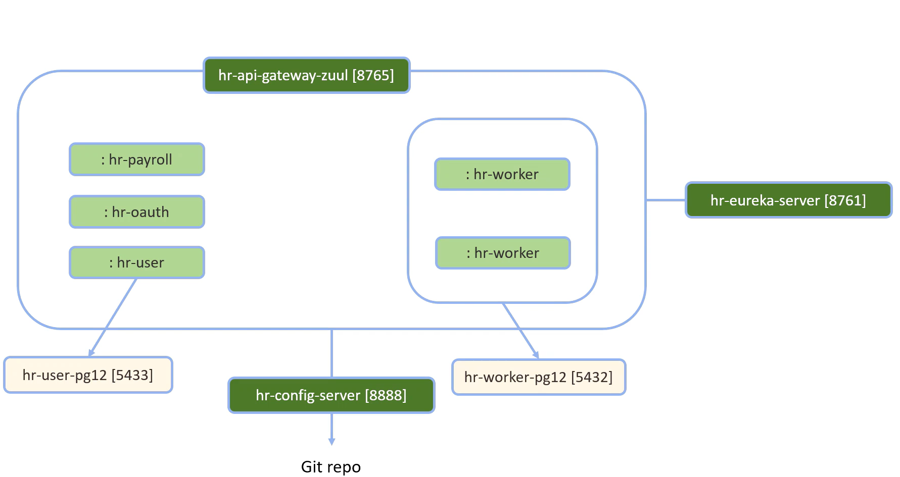

# Microsserviços Java com Spring Boot e Spring Cloud
### Aprenda a estruturar um sistema de microsserviços Java com Spring Boot e Spring Cloud.

Você vai aprender a criar, passo a passo e do absoluto zero, um sistema composto por vários microsserviços que comunicam entre si de forma transparente, escalável e com balanceamento de carga.
Os microsserviços são registrados em um "Discovery Server" (Eureka), de modo que a comunicação entre eles é feita pelo nome do microsserviço. Além disso, as requisições são feitas em um API Gateway (Zuul), responsável por rotear e autorizar as requisições.
Você vai aprender a trabalhar com autenticação e autorização, usando OAuth e tokens JWT. Além disso, vai aprender como gerar e testar os containers Docker para deixar os microsserviços e as bases de dados aptos para implantação.
O objetivo deste curso não é esgotar todos recursos do ecossistema Spring, mas sim apresentar uma introdução, de forma bem didática, de algumas das principais ferramentas do Spring Cloud, de modo que o desenvolvedor se familiarize com o processo básico de construção dos microsserviços, sua configuração e comunicação, e possa depois seguir se especializando se assim desejar.

Os conteúdos do curso incluem:
1. Feign para requisições de API entre microsserviços
2. Ribbon para balanceamento de carga
3. Servidor Eureka para registro dos microsserviços
4. API Gateway Zuul para roteamento e autorização
5. Hystrix para tolerância a falhas
6. OAuth e JWT para autenticação e autorização
7. Servidor de configuração centralizada com dados em repositório Git
8. Geração de containers Docker para os microsserviços e bases de dados

Este curso é de nível iniciante do ponto de vista de microsserviços e do ferramental Spring Cloud, mas vale ressaltar que não é para iniciantes em Java ou Spring Boot. É preciso já ter pelo menos conhecimento básico de construção de API's REST com Spring Boot e Java.
Estou muito feliz em apresentar este curso para você, e desejo que ele possa contribuir para você dar mais um passo na sua carreia. Um grande abraço e te vejo nas aulas.

## O que você aprenderá
1. Uma introdução a algumas das principais ferramentas do Spring Cloud para estruturação de um sistema em microsserviços
2. Chamadas de API entre microsserviços por meio de clientes Feign
3. Criar microsserviços escaláveis, com resolução de nomes e balanceamento de carga de forma transparente, usando servidor Eureka
4. Roteamento transparente de microsserviços com Zuul API Gateway
5. Configuração centralizada por meio de um servidor de configuração
6. Autenticação e autorização compartilhada por meio do API Gateway, usando Oauth e JWT
